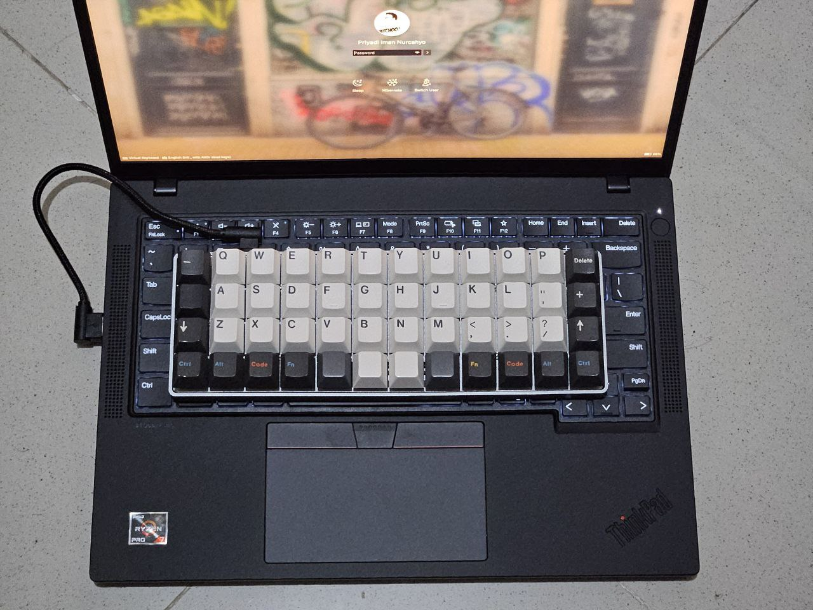

# Thinkpad Input Toggler

Turns off and on the keyboard, TrackPoint, and touchpad on a Thinkpad laptop by
pressing the 'star' button (<kbd>Fn</kbd>+<kbd>F12</kbd>) on the keyboard. Works
on the kernel level, does not depend on X11 or Wayland, the desktop environment,
or any GUI app. Works on the login and lock screens.

Displays notifications to all active users when the input is turned off or on.

It should work with the Thinkpad types that I have and used to have: P14s Gen 5
AMD, L14 Gen 2 Intel, X1 Carbon Gen 6, X1 Yoga Gen 8, X230 and X220. Though it
is possible I've made small changes throughout these years that I don't
remember.

With all the Thinkpads that I've used, the 'star' button
(<kbd>Fn</kbd>+<kbd>F12</kbd>) is on the separate logical keyboard (ThinkPad
Extra Buttons) than the main keyboard (AT Translated Set 2 keyboard). We are
taking advantage of this fact to keep the 'extra buttons' keyboard active all
the time, and be able to use the 'star' button to toggle the main keyboard on
and off. i.e. turning off the keyboard will not disable the 'star' button, thus
avoiding leaving you without any means to turn it back on.

## Why Would Anyone Do This?

In my case:

## Installation

Systemd-based Linux distro is required. But it should be trivial to adapt it for
other init systems.

* Install [interception-tools](https://gitlab.com/interception/linux/tools).
  This package depends on the presence of the directory
  `/etc/interception/udevmon.d/`.
* Read the `Makefile` and verify it is correct.
* `make && sudo make install`
* `systemctl enable udevmon.service`
* `systemctl restart udevmon.service`

## License

Do whatever you want with it.